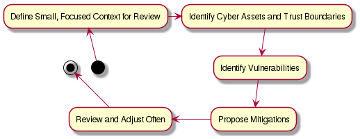
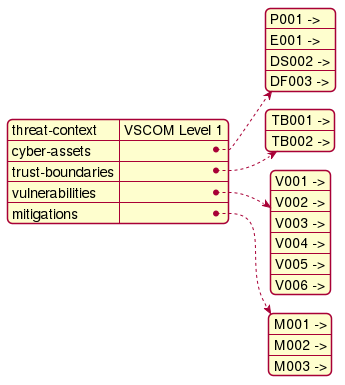
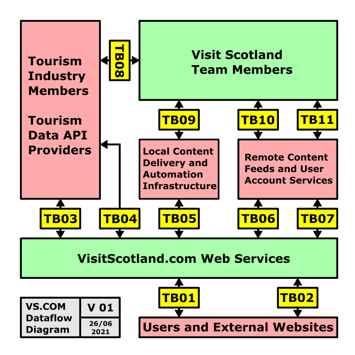
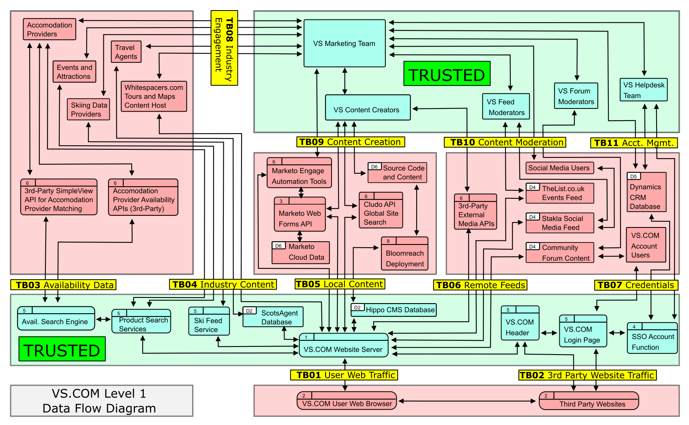

# Cybersecurity Threat Model

The VisitScotland.com website and associated services are required by the 
Scottish Government to meet the [Digital Scotland Service Standard](https://www.gov.scot/publications/digital-scotland-service-standard)

> The service standard aims to make sure that services in Scotland are continually improving and that users are always the focus. The Digital Scotland Service Standard is a set of 14 criteria that all organisations delivering public services should work towards. The standard has 3 themes. Meeting users’ needs: design and deliver inclusive and accessible services which meet the needs of users. Providing a service: make sure your products and services are sustainable and continually improving. Using the right technology: choose tools and technology that let you create a high quality service in a cost effective way.

*— ScotGov*

For details about the cybersecurity guidelines proscribed by the Digital Scotland Service Standard, see [Section 8: Create a Secure Service](https://www.gov.scot/publications/digital-scotland-service-standard/pages/8--create-a-secure-service-which-protects-users-privacy/)

## Table of Contents
1. [Threat Modelling Process](#threat-modelling-process)
2. [System Context](#system-context)
3. [Data Flow Diagram](#data-flow-diagram)
4. [Assets](#assets)
5. [Trust Boundaries](#trust-boundaries)
6. [Threat Actors](#threat-actors)
7. [Vulnerabilities](#vulnerabilities)
8. [Mitigations and CIS Controls](#mitigations-and-cis-controls)
9. [Residual Risk and Incident Response](#residual-risk-and-incident-response)

## Threat Modelling Process

### Agile Threat Modelling

[Agile Threat Modelling](https://martinfowler.com/articles/agile-threat-modelling.html) treats threat model reviews similarly to typical code reviews and encourages teams to construct threat models in small chunks, brick-by-brick:

> Start threat modelling 'little and often'. 
>
> Each threat modelling session with the team should be short and focussed enough to be quickly digested into something that can be delivered. Start by analysing the thinnest slice of your system possible; just what you are working on right now. Rather than trying to analyse your entire system upfront, build your team's muscle memory with threat modelling a little bit at a time.
>
> Practises which require a completely specified software design do not match how agile teams work. There is no reason why threat modelling needs to be an exhaustive upfront analysis. Too often teams are overwhelmed by comprehensive and highly structured approaches to threat modelling.
>
> Rather than creating and maintaining an exhaustive 'threat model' document, do threat modelling 'little and often'. When you work this way each threat modelling session is tiny, having little impact. Yet the cumulative effect of doing them has a huge impact. When you know you'll be doing this again every iteration, there's less incentive to try to do everything at once and more incentive to prioritize the most important work right now.

*- Martin Fowler, Agile Threat Modelling*

Threat model reviews should documented using this [review template](reviews/review-template.md) and reviews generally should result in at least one concrete task added to the team's backlog.

Once an initial threat model framework has been bootstrapped, the threat model can be filled in as a living set of documentation by conducting periodic reviews and generating backlog tasks.

### Reference Links

[OWASP Top 10](https://owasp.org/www-project-top-ten/)

[CWE Top 25](https://cwe.mitre.org/top25)

[MITRE ATT&CK Matrix](https://attack.mitre.org/)

[STRIDE with Examples](https://dr-knz.net/stride-threat-model-with-examples.html)

[Hardening Security's Vulnerability Search](https://hardening-security.com/vulnerabilities)

[STRIDE Example Adam Shostack](https://adam.shostack.org/uncover.html)

[Threat Modeling in Agile Workflows](http://moi.vonos.net/security/threat-modelling/)

[CVSS v3.1 Score Calculator](https://nvd.nist.gov/vuln-metrics/cvss/v3-calculator)

[How to Use CVSS Environmental Modifiers](https://www.balbix.com/insights/environmental-cvss-scores/)

[CIS Controls Implementation Groups](https://www.cisecurity.org/controls/implementation-groups/)

### Frameworks Applicable to this Threat Model

- Security Posture - Walled Garden
- Threat Identification Framework - STRIDE (per-interaction)
- Vulnerability Ranking Framework - CVSS (v3.1)
- Mitigation Framework - CIS Controls (v8)
- Incident Response Framework - NIST CS Incident Handling Guide (SP 800-61 Rev. 2)
- Quality Assurance Framework - Digital Scotland Service Standard

### Security Posture

A "walled garden" security posture means that we consider all entities, data stores, and processes internal to Visit Scotland as equally trusted. Anything external to Visit Scotland, for example a 3rd party cloud provider of marketing automation tools or externally-generated and moderated social media feeds, will be treated as less trusted.

A major drawback of taking a "walled garden" security posture is that if an attacker is able to compromise the internal Visit Scotland network or services, it is very likely that they will then be able to move laterally and compromise every VS.COM cyber asset fairly quickly. This means that risks such as ransomware should be considered a very high priority, since the entire set of VS.COM services could be potentially encrypted for ransom, not just a single asset at a time.

A more robust alternative to the "walled garden" security posture is "defense in depth". There is plenty of information to be found online about how to take a "defense in depth" security posture, for example [Some Articles Referenced by Science Direct](https://www.sciencedirect.com/topics/computer-science/defense-in-depth). At this time, however, the Visit Scotland organization does not possess the cybersecurity maturity level required to effectively implement a "defense in depth" security posture.

### Asset-First Construction

The VS.COM Cybersecurity Threat Model is constructed via an asset-first method. The guiding principles of the threat model are based around NIST-800 Cybersecurity Framework and Agile Threat Modelling. The process is roughly:

1. Define the System Context (requirements, stakeholders, threat actors, etc.)
2. Identify Cyber Assets and Trust Boundaries (assets include entities, processes, data Flows, and data stores)
3. Identify Asset Vulnerabilities (STRIDE, Evil Brainstorming, CWE, OWASP Top 10, etc.)
4. Propose Vulnerabilitiy Mitigations (CIS Controls Framework, industry standards, MITRE ATT&CK, etc.)
5. Review and Adjust Threat Model Frequently ([Little and Often](https://martinfowler.com/articles/agile-threat-modelling.html))

### Data Types

Threat Model Primary Data Types:
- Cyber Assets (entities, processes, data flows, and data stores)
- Trust Boundaries
- Vulnerabilities
- Mitigations

The following data formats were chosen to enable consistent referencing and linking between model elements:

### STRIDE Per Interaction

STRIDE per-interaction is a framework which can be used to more effectively enumerate credible threats to elements (cyber assets) in a data flow diagram. Typically, STRIDE users attempt to find at least one credible threat in each applicable category for the trusted element, data flow, and untrusted element. Sometimes the untrusted element can be considered to be out of scope for the threat model, however. In that case the untrusted element’s vulnerability entries would all be N/A.

**STRIDE can be applied per-element**

> **STRIDE-per-element**: This method of threat modeling is performed against each and every individual component making it a much more time consuming, exhaustive, and labrinthine. However, there are situations where a per-element model makes sense. It is however not effective in identifying threats that arise as a result of interaction between components. For example, a WiFi Evil Twin attack between an established wireless connection between the TCU and HU will only arise as a threat if there is a wireless network for communication and a previously established wireless session.

— Alissa Knight
https://alissaknight.medium.com/threat-modeling-of-connected-cars-using-stride-e8184764eb0a

**STRIDE can also be applied per-interaction**

> **STRIDE-per-interaction**: This type of model enumerates threats against interactions between components by considering the tuples (origin, destination, interaction) of the data in transit. This type of modeling is far less time consuming and exhaustive as it involves less components to be modeled. This type of model is ideal for cybersecurity threats since compromises typically involve communication between a source and destination.

— Alissa Knight
https://alissaknight.medium.com/threat-modeling-of-connected-cars-using-stride-e8184764eb0a

**For this threat model we have chosen to perform STRIDE per-interaction.**

For an example of how to apply STRIDE per-interaction see [Threat Modeling of Connected Cars](https://alissaknight.medium.com/threat-modeling-of-connected-cars-using-stride-e8184764eb0a)

#### STRIDE Categories: Definitions

| Property        | Threat   | Definition    | Example                          |
|-----------------|----------|---------------|----------------------------------|
| Authentication  | Spoofing | Impersonating something or someone else | Pretending to be any of billg, microsoft.com or ntdll.dll |
| Integrity       | Tampering | Modifying data or code | Modifying a DLL on disk or DVD, or a packet as it traverses the LAN. |
| Non-repudiation | Repudiation | Claiming to have not performed an action | "I didn’t send that email" or "I didn’t modify that file" |
| Confidentiality | Information Disclosure | Exposing information to someone not authorized to see it | Allowing someone to read the Windows source code; publishing a list of customers to a web site. |
| Availability    | Denial of Service | Deny or degrade service to users | Crashing Windows or a web site, sending a packet and absorbing seconds of CPU time, or routing packets into a black hole. |
| Authorization   | Elevation of Privilege | Gain capabilities without proper authorization | Allowing a remote internet user to run commands is the classic example, but going from a limited user to admin is also EoP. |

#### STRIDE Categories: Applying to DFD Elements

Not every STRIDE category applies to every element type (process, entity, data flow, and data store). See table below for which categories apply to each element type.

| Asset Type | Applicable STRIDE | Description                           |
|------------|-------------------|---------------------------------------|
| Data Flow  | _ T _ I D _       | Data in motion, for example an HTTP POST request initiated by a user completing a website form |
| Data Store | _ T R I D _       | Data at rest, for example the database backing a CRM service |
| Process    | S T R I D E       | A service or application, such as a Node JS web server |
| Entity     | S _ R _ _ _       | A person or group, such as 'website user' or 'government regulatory agency' |

#### STRIDE Categories: Corresponding Threats

| STRIDE Threat Category | ID | Property which Counters Threat | Example Mitigations with Improve the Property                                           |
|------------------------|----|--------------------------------|-----------------------------------------------------------------------------------------|
| Spoofing               | S  | Authenticity                   | SSL/TLS CA Certs, 2FA, Passwords, Access Tokens                                         |
| Tampering              | T  | Integrity                      | SSL/TLS Messsage Digests, Hashes, Checksums                                             |
| Repudiation            | R  | Non-repudiability              | Access and Audit Logs, Append-only DBs, Backups and Shadow Copies                       |
| Information Disclosure | I  | Confidentiality                | SSL/TLS Encryption, Firewalls, Disk Encryption                                          |
| Denial of Service      | D  | Availability                   | Isolation (containers, VMs, OS privilege domains), QoS Throttling, Auto-scaling         |
| Elevation of Privilege | E  | Authorization                  | Access Control Lists, Design for Principle of Least Privilege, Capability-based Control |

### Composable Element ID Formats

Each data type (asset, vulnerability, trust boundary, etc.) is assigned a unique prefix for its ID format. This allows for flexible composition of component reference codes. Composition is optional, but can make it easier for people to know right away in what context a reference is made. For example, while referring to vulnerability V007 is valid, referring to a composed ID of L1-VSCOM-TB002-P002-V007 instead lets the reader know right away that vulnerability 007 affects process P002 within trust boundary TB002 in the Level 1 data flow diagram of the VSCOM product.

Composable ID Codes are model-wide unique 3-digit numbers with a letter prefix indicating the model element type. The exception is the threat context level and title short code. These are optional and not model-wide unique. They simply help clarify in which model context the element can be found.

**Composable Element ID Formats**

- Threat Context Level: L0
- Data Flow Diagram Title Short Code: XXXXX
- Process (asset, DFD element): P000
- Entity (asset, DFD element): E000
- Data Flow (asset, DFD element): DF000
- Data Store (asset, DFD element): DS000
- Trust Boundaries: TB000
- Vulnerabilities: V000
- Mitigations: M000

**Examples**

| ID Code                   | Description                                      |
|---------------------------|--------------------------------------------------|
| L1-VSCOM-TB001-P001-V005  | Vulnerability 005 of Process 001 within Trust Boundary 001 of Level 1 Data Flow Diagram 'VSCOM' |
| L1-VSCOM                  | Level 1 Data Flow Diagram 'VSCOM' |
| L1-VSCOM-P001             | Process 001 of Level 1 Data Flow Diagram 'VSCOM' |
| L1-VSCOM-TB003-DF004-V009 | Vulnerability 009 of Data Flow 004 across Trust Boundary 003 of Level 1 Data Flow Diagram 'VSCOM' |
| L1-VSCOM-TB001            | Trust Boundary 001 of Level 1 Data Flow Diagram 'VSCOM' |
| L1-VSCOM-M003             | Mitigation 003 of Level 1 Data Flow Diagram 'VSCOM' |

## System Context

### Core Functionality

VS.COM is a tool whose primary purpose is to help the VS marketing team engage with the public to encourage people to spend more money on tourism services in Scotland and help make the booking process easier.

[VS.COM Architecture Detailed Specification](https://confluence.visitscotland.com/display/CA/Architecture+Detailed+Specification)

## Data Flow Diagram

In the context of a cybersecurity threat model, the purpose of a dataflow diagram is to help threat modelers draw useful and accurate Trust Boundaries and identify cyber assets which need to be protected.

A trust boundary is a data flow where one side is less trusted than another. It does not matter whether the data flow is bidirectional or unidirectional, only that one side is less trusted than the other. If both sides are trusted equally, according to the organization’s chosen security posture, then there is no trust boundary present.

**Threats exist only where a trust boundary is present.**

Threats can be to assets on either or both sides of the trust boundary and also to the data flow medium itself.

### Threat Actors

A Cybersecurity Threat Actor can be defined as:

> A participant (person or group) in an action or process that is characterized by malice or hostile action (intending harm) using computers, devices, systems, or networks.
>
> Threat Actors can be classified into groups based on their motivations and affiliations, for example:
>
> cybercriminals, insiders, nation-state actors, hactivists, and terrorist organizations

*- [CIS Security Spotlight: Threat Actors](https://www.cisecurity.org/insights/spotlight/cybersecurity-spotlight-cyber-threat-actors)*

Identifying credible threat actors helps give important context to threat modelers using a [risk-based approach](https://www.ncsc.gov.uk/collection/risk-management-collection/essential-topics/get-basics-right-risk-management-principles-cyber-security). For example, if it is unlikely that a nation-state level threat actor would take an interest in a product or service, there is no point spending effort identifying vulnerabilities, mitigations, and incident response playbooks related to nation-state level abuse cases.

**TODO**: Fill this section out with links to VS.COM credible threat actor profiles

Threat actors can be documented in the 'threat-actors' directory using the [threat actor Markdown template](threat-actors/threat-actor-template.md)

### Abuse Cases

[OWASP Abuse Case Cheat Sheet](https://cheatsheetseries.owasp.org/cheatsheets/Abuse_Case_Cheat_Sheet.html)

An Abuse case can be defined as:

> A way to use a feature that was not expected by the implementer,
allowing an attacker to influence the feature or outcome of use of
the feature based on the attacker action (or input).

Abuse cases are useful when conducting threat models because they give some context about how threat actors might successfully exploit system vulnerabilities.

Synopsys define an Abuse Case like this:

> Misuse and abuse cases describe how users misuse or exploit the weaknesses of controls in software features to attack an application.
>
> This can lead to tangible business impact when a direct attack against business functionalities, which may bring in revenue or provide positive user experience, are attacked.
>
> Abuse cases can also be an effective way to drive security requirements that lead to proper protection of these critical business use cases.

*- [Synopsys Source](https://www.synopsys.com/blogs/software-security/abuse-cases-can-drive-security-requirements)*

Abuse cases can be documented in the 'abuse-cases' folder using the [abuse case Markdown template](abuse-cases/abuse-case-template.md)

**TODO**: Add in links to credible abuse cases here

## Assets

Cyber assets include processes, data stores, data flows, and entities which are required for the organization to carry out its mission.

Cyber assets can be internal or external to the organization and entities can represent either individuals or organizations.

Assets can be documented using the [asset template](assets/asset-template.md)

The format in which assets are documented should be determined by how the information is used in the wider threat model.

## Trust Boundaries

Trust boundaries contain a set of cyber assets which are at an equivalent level of trust. Some of the trusted assets are connected via data flows to less trusted processes, entities, or data stores.

Threats can only be defined where data flows across a trust boundary.

Trust boundaries should be documented in the 'trust-boundaries' folder using the [trust boundary template](trust-boundaries/trust-boundary-template.md).

## Vulnerabiliites

This threat model uses a [risk-based approach](https://www.ncsc.gov.uk/collection/risk-management-collection/essential-topics/get-basics-right-risk-management-principles-cyber-security) to prioritizing threats and mitigations.

Vulnerabilities (credible threats) identified during the threat modelling process are weighted and ranked using the [Common Vulnerability Scoring System](https://first.org/cvss/user-guide).

CVSS v3.1 Overview:

> The Common Vulnerability Scoring System (CVSS) is an open framework for communicating the characteristics and severity of software vulnerabilities. CVSS consists of three metric groups: Base, Temporal, and Environmental. The Base group represents the intrinsic qualities of a vulnerability that are constant over time and across user environments, the Temporal group reflects the characteristics of a vulnerability that change over time, and the Environmental group represents the characteristics of a vulnerability that are unique to a user’s environment. The Base metrics produce a score ranging from 0 to 10, which can then be modified by scoring the Temporal and Environmental metrics. A CVSS score is also represented as a vector string, a compressed textual representation of the values used to derive the score.

*— First.org Inc.*

For examples of how to calculate a CVSS v3.1 score see [CVSS v3.1 Examples](https://www.first.org/cvss/v3.1/examples)

**TODO**: Fill this section out with links to the vulnerabilities identified in the STRIDE tables

[CRITICAL Vulnerabilties](vulnerabilities/CRITICAL.md)
[HIGH Vulnerabilties](vulnerabilities/HIGH.md)
[MEDIUM Vulnerabilties](vulnerabilities/MEDIUM.md)
[LOW Vulnerabilties](vulnerabilities/LOW.md)
[3rd Party Vulnerabilties](vulnerabilities/3RDPARTY.md)

## Mitigations and CIS Controls

This threat model uses a [risk-based approach](https://www.ncsc.gov.uk/collection/risk-management-collection/essential-topics/get-basics-right-risk-management-principles-cyber-security) to prioritizing threats and mitigations.

Mitigations represent requirements put in place to reduce the risk that cyber assets could be compromised by an attacker. Mitigations often represent a 1:Many relationship where a single mitigation reduces the risk that several different exploits could be executed successfully. 

Mitigations can be both the parent and the child of product requirements. For example, regulatory requirements may call for specific mitigations to be put into place at a higher-level while the required high-level mitigations may generate lower-level product requirements of their own.

In addition to mitigations put in place to reduce the risk that specific vulnerabilities can be exploited by threat actors, general "best practice" mitigations are to be put in place following the [CIS Controls framework](https://cisecurity.org/controls/v8).

**TODO**: Fill this section out with links to the mitigations identified in the STRIDE tables

[CRITICAL Mitigations](mitigations/CRITICAL.md)
[Recommended Mitigations](mitigations/recommended.md)
[Optional Mitigations](mitigations/optional.md)
[3rd Party Mitigations](mitigations/3RDPARTY.md)

**CIS Controls v8 Overview**

> The CIS Controls are a prioritized set of Safeguards to mitigate the most prevalent cyber-attacks against systems and networks. They are mapped to and referenced by multiple legal, regulatory, and policy frameworks. CIS Controls v8 has been enhanced to keep up with modern systems and software. Movement to cloud-based computing, virtualization, mobility, outsourcing, Work-from-Home, and changing attacker tactics prompted the update and supports an enterprise’s security as they move to both fully cloud and hybrid environments.

*— CIS Security*

CIS Controls can be mapped to other security standards via CIS Security’s [CIS Controls Navigator](https://www.cisecurity.org/controls/cis-controls-navigator)

**TODO**: Put links here to:

- **Visit Scotland's CIS Controls policy** (general quality standards, maintained by IT)
- **VisitScotland.com Product Requirement Specification** (specific requirements, mainted by VS.COM product owners)
- **Evidence that VisitScotland.com meets the cybersecurity requirements** (test plans, results, coding standards, audit reports, etc., maintained by DevOps and Test Engineering teams)

## Residual Risk and Incident Response

As with any complex system, there will always be some residual risk present that security vulnerabilities will be exploited by threat actors to compromise VisitScotland.com cyber assets.

Visit Scotland have put in place various cybersecurity incident response plans for IT and other stakeholders to follow, should an incident occur.

The incident response plans generally follow the [NIST Computer Security Incident Handling Guide](https://csrc.nist.gov/publications/detail/sp/800-61/rev-2/final):

    Computer security incident response has become an important component of information technology (IT) programs. Because performing incident response effectively is a complex undertaking, establishing a successful incident response capability requires substantial planning and resources. This publication assists organizations in establishing computer security incident response capabilities and handling incidents efficiently and effectively. This publication provides guidelines for incident handling, particularly for analyzing incident-related data and determining the appropriate response to each incident. The guidelines can be followed independently of particular hardware platforms, operating systems, protocols, or applications.

*— National Institute for Standards and Technology SP 800-61 Rev. 2*

CIS Security has published a template guide to help navigate between the various functions to be addressed as part of an incident response plan: [NIST CSF Policy Template](https://www.cisecurity.org/wp-content/uploads/2020/07/NIST-CSF-Policy-Template-Guide-2020-0720-1.pdf)

**TODO**: Put links here to Visit Scotland's incident response proceedures (maintained by IT)

[Visit Scotland Cybersecurity Policies](https://confluence.visitscotland.com/display/VCE/Cyber+Security+Policies)